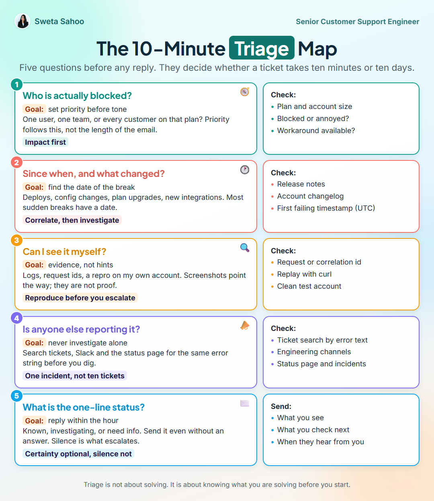

# The 10-minute triage map

_2026-09-15 · Playbooks · [Discuss on LinkedIn](https://www.linkedin.com/feed/update/urn:li:share:7505738576421158912/)_

## The card

Five questions before any reply. They decide whether a ticket takes ten minutes or ten days.

### 1. Who is actually blocked? 🧭

**Goal:** set priority before tone

One user, one team, or every customer on that plan? Priority follows this, not the length of the email.

_Impact first_

**Check:** Plan and account size · Blocked or annoyed? · Workaround available?

### 2. Since when, and what changed? 🕐

**Goal:** find the date of the break

Deploys, config changes, plan upgrades, new integrations. Most sudden breaks have a date.

_Correlate, then investigate_

**Check:** Release notes · Account changelog · First failing timestamp (UTC)

### 3. Can I see it myself? 🔍

**Goal:** evidence, not hints

Logs, request ids, a repro on my own account. Screenshots point the way; they are not proof.

_Reproduce before you escalate_

**Check:** Request or correlation id · Replay with curl · Clean test account

### 4. Is anyone else reporting it? 📣

**Goal:** never investigate alone

Search tickets, Slack and the status page for the same error string before you dig.

_One incident, not ten tickets_

**Check:** Ticket search by error text · Engineering channels · Status page and incidents

### 5. What is the one-line status? ✉️

**Goal:** reply within the hour

Known, investigating, or need info. Send it even without an answer. Silence is what escalates.

_Certainty optional, silence not_

**Send:** What you see · What you check next · When they hear from you

> Triage is not about solving. It is about knowing what you are solving before you start.

## Notes

The best support engineers are slow for the first ten minutes.

Everyone else jumps straight into the reply box. They spend ten minutes on triage instead, and the ticket closes days earlier.

Five questions, every time:

1. Who is actually blocked?
2. Since when, and what changed?
3. Can I see it myself?
4. Is anyone else reporting it?
5. What is the one-line status I can send right now?

Question 5 is the one people skip. A customer who hears "we see it, we are investigating" within the hour will wait two days calmly. A customer who hears nothing escalates by lunch.

The card has the full version with what I check for each step.

Which question would you add as number six?

---
Text and images © Sweta Sahoo, licensed [CC BY 4.0](../LICENSE).
