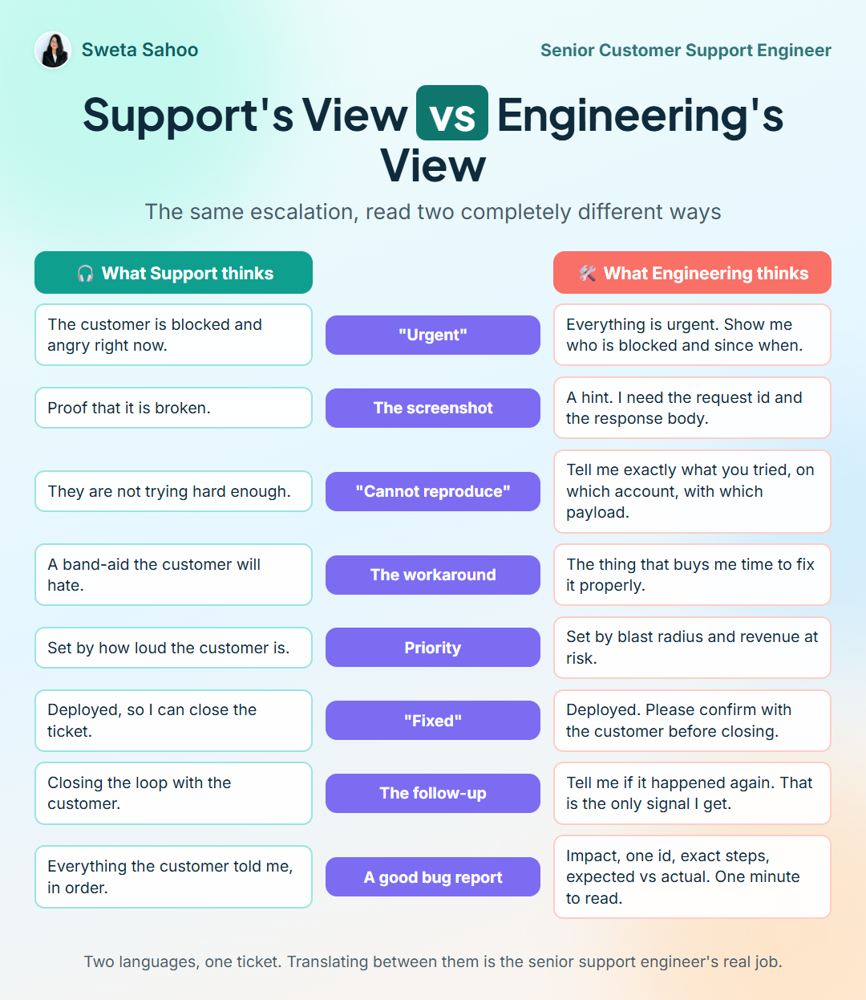

# Support's view vs Engineering's view

_2026-09-16 · Playbooks · [Discuss on LinkedIn](https://www.linkedin.com/feed/update/urn:li:share:7505994386053353472/)_

## The card

The same escalation, read two completely different ways

| 🎧 What Support thinks | | 🛠️ What Engineering thinks |
|---|---|---|
| The customer is blocked and angry right now. | **"Urgent"** | Everything is urgent. Show me who is blocked and since when. |
| Proof that it is broken. | **The screenshot** | A hint. I need the request id and the response body. |
| They are not trying hard enough. | **"Cannot reproduce"** | Tell me exactly what you tried, on which account, with which payload. |
| A band-aid the customer will hate. | **The workaround** | The thing that buys me time to fix it properly. |
| Set by how loud the customer is. | **Priority** | Set by blast radius and revenue at risk. |
| Deployed, so I can close the ticket. | **"Fixed"** | Deployed. Please confirm with the customer before closing. |
| Closing the loop with the customer. | **The follow-up** | Tell me if it happened again. That is the only signal I get. |
| Everything the customer told me, in order. | **A good bug report** | Impact, one id, exact steps, expected vs actual. One minute to read. |

> Two languages, one ticket. Translating between them is the senior support engineer's real job.

## Notes

Support and engineering read the same escalation in two different languages.

"Urgent" means the customer is angry. "Urgent" means show me who is blocked and since when.

A screenshot is proof. A screenshot is a hint.

"Fixed" means I can close the ticket. "Fixed" means please confirm with the customer first.

In five years between support queues and engineering channels I learned that most friction is not attitude. It is translation. The support engineer who can write in both languages gets bugs fixed in days, not quarters.

The last row of the infographic is the one that matters most: what a good bug report looks like from the engineer's side.

Which row hits closest to home for your team?

---
Text and images © Sweta Sahoo, licensed [CC BY 4.0](../LICENSE).
