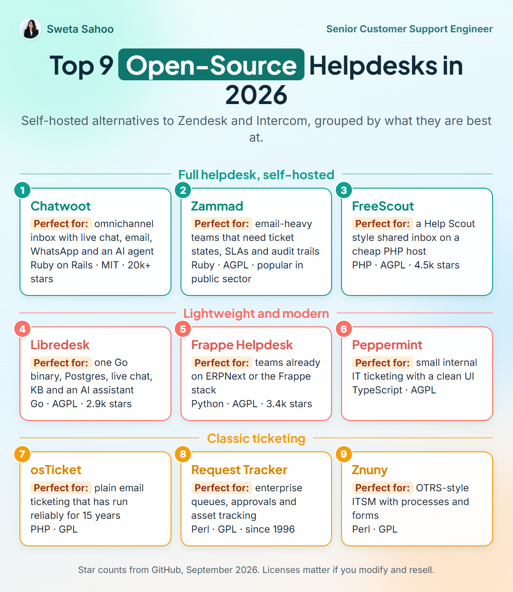

# Top 9 open-source helpdesks in 2026

_2026-09-17 · Tools · [Discuss on LinkedIn](https://www.linkedin.com/feed/update/urn:li:share:7506336286308483072/)_

## The card

Self-hosted alternatives to Zendesk and Intercom, grouped by what they are best at.

### Full helpdesk, self-hosted

1. **Chatwoot** · **Perfect for:** omnichannel inbox with live chat, email, WhatsApp and an AI agent · Ruby on Rails · MIT · 20k+ stars
2. **Zammad** · **Perfect for:** email-heavy teams that need ticket states, SLAs and audit trails · Ruby · AGPL · popular in public sector
3. **FreeScout** · **Perfect for:** a Help Scout style shared inbox on a cheap PHP host · PHP · AGPL · 4.5k stars

### Lightweight and modern

4. **Libredesk** · **Perfect for:** one Go binary, Postgres, live chat, KB and an AI assistant · Go · AGPL · 2.9k stars
5. **Frappe Helpdesk** · **Perfect for:** teams already on ERPNext or the Frappe stack · Python · AGPL · 3.4k stars
6. **Peppermint** · **Perfect for:** small internal IT ticketing with a clean UI · TypeScript · AGPL

### Classic ticketing

7. **osTicket** · **Perfect for:** plain email ticketing that has run reliably for 15 years · PHP · GPL
8. **Request Tracker** · **Perfect for:** enterprise queues, approvals and asset tracking · Perl · GPL · since 1996
9. **Znuny** · **Perfect for:** OTRS-style ITSM with processes and forms · Perl · GPL

> Star counts from GitHub, September 2026. Licenses matter if you modify and resell.

## Notes

Nine open-source helpdesks that replace Zendesk or Intercom, sorted by what they are actually good at.

Every few months someone asks me which self-hosted helpdesk to pick. The honest answer is: it depends on your team, so here are nine, grouped.

Full helpdesks: Chatwoot, Zammad, FreeScout. Lightweight and modern: Libredesk, Frappe Helpdesk, Peppermint. Classic ticketing: osTicket, Request Tracker, Znuny.

My pick for a team of two to twenty in 2026 is Libredesk: one Go binary plus Postgres, live chat and email in one inbox, a help center, and an AI assistant grounded in your own knowledge base that hands off to a human when it cannot answer. Younger than Chatwoot, fewer channels, but the cleanest setup I have tried.

Star counts are from GitHub this week. Licenses (MIT vs AGPL vs GPL) matter if you plan to modify and resell.

Which one did I miss? Links in the comments.

## Sources

- https://github.com/chatwoot/chatwoot
- https://github.com/zammad/zammad
- https://github.com/freescout-help-desk/freescout
- https://github.com/abhinavxd/libredesk
- https://github.com/frappe/helpdesk
- https://github.com/Peppermint-Lab/peppermint
- https://github.com/osTicket/osTicket
- https://github.com/bestpractical/rt
- https://github.com/znuny/Znuny

---
Text and images © Sweta Sahoo, licensed [CC BY 4.0](../LICENSE).
